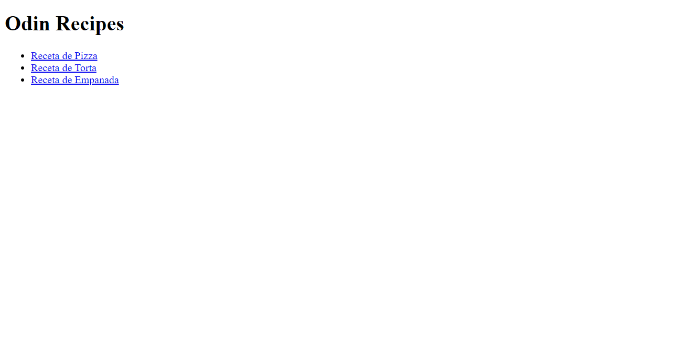

# Odin Recipes

> This project displays a page of food recipes using only HTML. The instructions are used 
TheOdinProject page

   

## Built With

- HTML

## Live Demo

[Live Demo Link](https://elloquius.github.io/odin-recipes/)

## Getting Started

To get a local copy up and running follow these simple example steps.

### Prerequisites

Have git installed on your PC, as well as a code editor like VSCode. 

### Install

Clone this repository on your local machine and preferably install live server if using vscode

### Usage

Right click inside the index.html file and then click "Open with live server"

## Authors

👤 **ELLOQUIUS**

- GitHub: [@elloquius](https://github.com/ELLOQUIUS)

## 🤝 Contributing

Contributions, issues, and feature requests are welcome!

Feel free to check the [issues page](../../issues/).

## Show your support

Give a ⭐️ if you like this project!

## Acknowledgments

- The Odin Project
